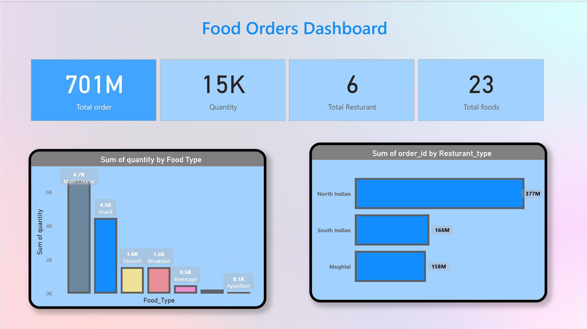

# 🍽️ Food Orders Dashboard

> **Turning raw food order data into actionable business intelligence — one chart at a time.**



---

## 📌 Project Description

The **Food Orders Dashboard** is an interactive business intelligence dashboard built to analyze and visualize food ordering patterns across multiple restaurants. It transforms transactional order data into clear, digestible insights — covering order volumes, food preferences, and restaurant performance.

---

## ✨ Key Features

- 📊 **KPI Summary Cards** — Instant view of total orders, quantity, restaurants, and food items
- 🍱 **Food Type Analysis** — Bar chart breakdown of order quantity by food category
- 🏪 **Restaurant Type Performance** — Horizontal bar chart comparing order volumes by cuisine type
- 🔗 **Relational Data Model** — Linked tables across Customer, Food, Orders, and Restaurant datasets
- 📅 **Multi-Month Data Coverage** — Covers order data across multiple months (e.g., April 2023, February 2023)

---

## 📈 Dashboard Insights

| Metric | Value |
|---|---|
| 🛒 Total Orders | 701M |
| 📦 Total Quantity | 15K |
| 🏬 Total Restaurants | 6 |
| 🍜 Total Food Items | 23 |

### 🍱 Quantity by Food Type
- **Main Course** dominates with **6.7K** units ordered — the clear customer favourite
- **Snacks** follow at **4.5K**, showing strong demand for lighter options
- **Dessert** and **Breakfast** are tied at **1.6K** each
- **Beverages (0.5K)** and **Appetizers (0.1K)** are niche but consistent categories

### 🏪 Orders by Restaurant Type
- **North Indian** cuisine leads significantly with **377M** orders
- **South Indian** comes in second at **166M** orders
- **Mughlai** rounds out the top three at **158M** orders

> 💡 **Key Takeaway:** North Indian cuisine and Main Course items are the primary revenue drivers — a strong signal for inventory planning and promotional focus.

---


## 🗄️ Dataset Description

The dataset is structured across **4 relational tables** within an Excel workbook, simulating a real-world food ordering system.

---

### 📋 Table Overview

| Table | Description |
|---|---|
| `Orders Data` | Core transactional table — one row per order placed |
| `Customer_Details` | Lookup table for customer profile information |
| `Food_Details` | Lookup table for food item metadata |
| `Restaurant_Details` | Lookup table for restaurant information |

---

### 🔍 Column Reference

**`Orders Data`** *(Fact Table)*
| Column | Type | Description |
|---|---|---|
| `order_id` | Numeric | Unique identifier for each order |
| `orderDate` | Date | Date the order was placed |
| `customer_id` | Numeric | Foreign key linking to Customer_Details |
| `Resturant_ID` | Numeric | Foreign key linking to Restaurant_Details |
| `Fooditem` | Numeric | Foreign key linking to Food_Details |
| `quantity` | Numeric | Number of units ordered |
| `deliver_status` | Text | Delivery outcome (e.g., *Delivered*) |
| `payment_method` | Text | Payment mode used (e.g., *UPI*) |

**`Customer_Details`**
| Column | Description |
|---|---|
| `customer_id` | Unique customer identifier |
| `customer_name` | Full name of the customer |
| `member_Type` | Membership tier or category |

**`Food_Details`**
| Column | Description |
|---|---|
| `Food Name` | Name of the food item |
| `Food_Type` | Category (Main Course, Snack, Dessert, etc.) |
| `ItemCode` | Unique code for each food item |

**`Restaurant_Details`**
| Column | Description |
|---|---|
| `Resturant_Code` | Unique restaurant identifier |
| `Resturant_Name` | Name of the restaurant |
| `Resturant_type` | Cuisine type (North Indian, South Indian, Mughlai) |

---

### 📅 Data Coverage

- **Time Period:** Multi-month order history (confirmed: February 2023, April 2023)
- **Total Records:** Large-scale dataset aggregating to **701M** in order value
- **Order Status:** Primarily `Delivered` orders captured in the dataset
- **Payment Methods:** UPI confirmed; additional methods may be present

---


## 🛠️ Tech Stack

| Tool | Purpose |
|---|---|
| **Microsoft Excel / Power BI** | Dashboard design and data visualization |
| **Power Query** | Data transformation and cleaning |
| **DAX** | Calculated measures and KPIs |
| **Data Source** | Excel Workbook (`Food-Orders.xlsx`) |

> 📝 *Update this section with the exact tools used in your workflow.*

---

## 📸 Screenshots

### Dashboard Overview


### Data Model / Source Table


> 📁 *Place your screenshots in the `/screenshots` folder and update the paths above.*

---

## 🚀 Installation / Usage Instructions

### Prerequisites
- Microsoft Excel 2016+ **or** Power BI Desktop
- The source data file: `Food-Orders.xlsx`

### Steps to Open

**For Excel:**
1. Clone or download this repository
   ```bash
   git clone https://github.com/asmita-coc/food-orders-powerbi.git
   ```
2. Open `Food-Orders-Dashboard.xlsx` in Microsoft Excel
3. If prompted, click **Enable Content** to allow data connections
4. Navigate to the **Dashboard** sheet to view the visuals

**For Power BI:**
1. Open `Food-Orders-Dashboard.pbix` in Power BI Desktop
2. If the data source path has changed, go to **Transform Data → Data Source Settings** and update the file path
3. Click **Refresh** to load the latest data

---

## 📁 Folder Structure

```
food-orders-dashboard/
│
├── 📊 Food-Orders-Dashboard.xlsx   # Main dashboard file
├── 📄 Food-Orders.xlsx             # Raw source data
│
├── 📁 screenshots/                 # Dashboard preview images
│   ├── Food-Orders-Dashboard.png
│   └── Snow-Man.png
│
└── 📄 README.md                    # Project documentation
```

---

## 🔮 Future Improvements

- [ ] 🗓️ Add a **date slicer** for dynamic month/year filtering
- [ ] 💳 Breakdown by **payment method** (UPI, Cash, Card)
- [ ] 🚚 Track **delivery status** trends over time (Delivered vs. Pending)
- [ ] 👤 Add **customer segmentation** by membership type
- [ ] 📍 Incorporate **geographic analysis** if location data is available
- [ ] 🔄 Connect to a **live database** for real-time order tracking

---

## 👤 Author / Contact

**AR**

- 💼 LinkedIn: [linkedin.com/in/your-profile](https://linkedin.com/in/your-profile)
- 📧 Email: your.email@example.com
- 🐙 GitHub: [@your-username](https://github.com/your-username)

---

<p align="center">
  ⭐ If you found this project helpful, please consider giving it a star!
</p>
